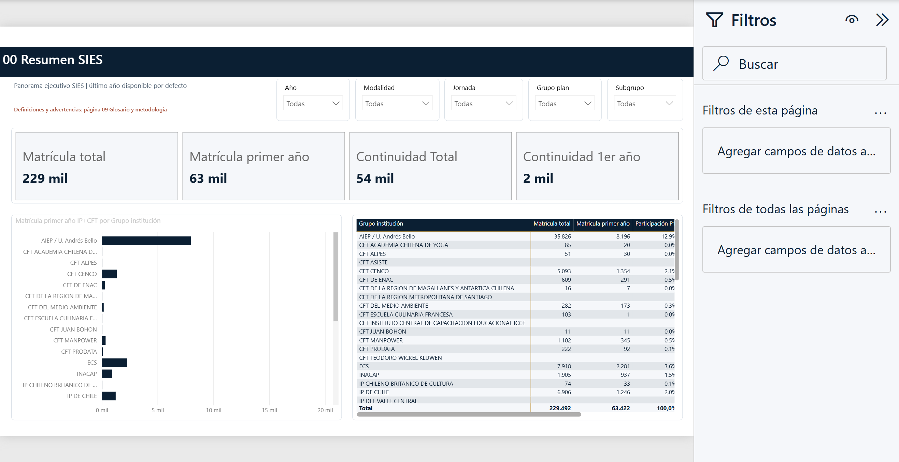

# SIES IP, CFT y Universidades



Informe Power BI para analizar la matrícula de pregrado **no presencial y semipresencial** de Institutos Profesionales (IP), Centros de Formación Técnica (CFT) y Universidades en Chile entre 2023 y 2026.

El proyecto incluye datos públicos agregados de SIES, un modelo semántico documentado, medidas DAX, segmentadores y diez páginas de análisis. También conserva una vista institucional de ECS construida exclusivamente con información pública SIES.

> Este es un proyecto analítico independiente. No es un producto oficial de SIES ni del Ministerio de Educación.

## Novedades de la versión 1.2.0

- Separación de los tres tipos oficiales SIES: **Plan Regular**, **Plan Especial** y **Plan Regular de Continuidad**.
- Uso de **Regular 1er año** como indicador principal de captación, ranking y segmentación competitiva.
- Plan Especial visible por separado; Continuidad se presenta solo con matrícula total porque SIES no la considera posible de contar con primer año.
- PBIX portable para abrir el informe con los datos 2023–2026 ya importados.

## Inicio rápido

### Solo quiero visualizar el informe

1. Abra la [última versión publicada](https://github.com/amuletofloss/SIES_IP_CFT_U/releases/latest).
2. Descargue `SIES_IP_CFT_U_v1.2.0.pbix`.
3. Ábralo con una versión reciente de Microsoft Power BI Desktop.

El PBIX incluye los datos importados y permite navegar inmediatamente, aunque los CSV no estén disponibles. Para actualizar los datos use el proyecto PBIP y el procedimiento de la sección siguiente.

### Quiero editar el proyecto PBIP

Requisitos:

- Windows 10 u 11.
- Microsoft Power BI Desktop estándar y actualizado; no la edición para Report Server.
- Windows PowerShell 5.1 o PowerShell 7.

Después de descargar o clonar el repositorio, ejecute desde la carpeta raíz:

```powershell
.\scripts\Preparar-PBIP.ps1 -Abrir
```

El script crea una copia local ignorada por Git, configura la ruta de datos y abre `.local\SIES_IP_CFT_U\SIES_IP_CFT_U.pbip`. Para recrearla posteriormente:

```powershell
.\scripts\Preparar-PBIP.ps1 -Recrear -Abrir
```

El proyecto original conserva una ruta genérica para evitar publicar nombres de usuario o ubicaciones personales.

## Qué puede analizarse

- Matrícula total, primer año SIES y primer año de Plan Regular.
- Mercado IP+CFT y mercado universitario.
- Modalidad No Presencial o Semipresencial.
- Jornadas A Distancia, Diurna, Vespertina, Otra y Semipresencial.
- Institución, grupo institucional, nombre de carrera, área genérica, duraciones y territorio.
- Planes Regular, Especial y Regular de Continuidad, sin mezclar Especial con Continuidad.
- Participación, ranking, evolución anual y concentración competitiva.
- ECS frente al mercado, usando los mismos datos públicos SIES que el resto del informe.

## Páginas del informe

| Página | Contenido |
|---|---|
| 00 Resumen SIES | Indicadores ejecutivos y filtros principales |
| 01 Mercado IP+CFT | Tamaño, participación y ranking del subsistema técnico-profesional |
| 02 Mercado universitario | Universidades por área genérica y nombre de carrera |
| 03 Tipos de plan SIES | Regular, Especial y Continuidad; total y primer año cuando corresponde |
| 04 Evolución 2023–2026 | Tendencias anuales por tipo de plan SIES |
| 05 Portafolio ECS vs mercado | Comparación institucional y áreas de conocimiento |
| 06 Concentración por área | Área de conocimiento, área genérica y nombre de carrera |
| 07 Mapa competitivo | Grupos nominados y categorías residuales |
| 08 Detalle SIES | Nombre de carrera y duraciones de estudio y total |
| 09 Glosario y metodología | Definiciones, reglas y clasificación competitiva |

Todas las páginas analíticas incluyen filtros por **Año, Modalidad, Jornada y Tipo de plan SIES**.

## Criterios metodológicos principales

- **Plan Regular:** ingreso desde primer año sin una certificación previa distinta de la propia del proceso de selección.
- **Plan Especial:** programa dirigido a un grupo específico de estudiantes; puede informar primer año.
- **Plan Regular de Continuidad:** exige estudios superiores previos; SIES no lo considera posible de contar con primer año.
- **Otros competidores:** grupos IP con menos de 900 matrículas regulares de primer año en la base fija 2026.
- **U (otras):** grupos exclusivamente universitarios con menos de 70 matrículas regulares de primer año en la base fija 2026.
- **CFT (otros):** CFT sin marca competitiva nominada; no utiliza umbral.

El tipo de plan es autorreportado por cada institución a SIES. El informe conserva esa clasificación aunque una oferta parezca corresponder a otro tipo y explicita la advertencia en el glosario. La metodología completa está en [docs/METODOLOGIA.md](docs/METODOLOGIA.md).

## Datos y privacidad

Los archivos incluidos contienen conteos agregados por institución, carrera, sede, modalidad, jornada y tipo de plan. No contienen nombres de estudiantes, RUT, correos, teléfonos ni identificadores personales.

El repositorio no incluye la planilla original, presentaciones internas, rutas de OneDrive, nombres de usuarios, cachés de Power BI ni archivos de recuperación. Consulte [PRIVACY.md](PRIVACY.md) antes de publicar una actualización.

## Estructura

```text
SIES_IP_CFT_U/
├── SIES_IP_CFT_U.pbip
├── SIES_IP_CFT_U.Report/
├── SIES_IP_CFT_U.SemanticModel/
├── SIES_IP_CFT_U.Data/
├── docs/
├── scripts/
└── release-assets/
```

- `SIES_IP_CFT_U.Report`: definición PBIR de páginas y objetos visuales.
- `SIES_IP_CFT_U.SemanticModel`: modelo TMDL, relaciones y medidas DAX.
- `SIES_IP_CFT_U.Data`: datos agregados y controles reproducibles.
- `scripts`: preparación local y revisión de privacidad.
- `release-assets`: instrucciones para publicar el PBIX, no el binario versionado.

## Actualización y validación

1. Sustituya los CSV curados manteniendo nombres, columnas y tipos.
2. Ejecute `Preparar-PBIP.ps1 -Recrear -Abrir`.
3. En Power BI seleccione **Inicio > Actualizar**.
4. Revise las conciliaciones descritas en [docs/VALIDACION.md](docs/VALIDACION.md).
5. Ejecute `.\scripts\Validar-Privacidad.ps1` antes de cualquier publicación.

## Publicar una nueva versión

1. Actualice y valide el PBIP público.
2. Genere el PBIX con Power BI Desktop y guárdelo en `release-assets/`.
3. Ejecute `scripts/Validar-Privacidad.ps1 -IncluirBinarios`.
4. Registre el tamaño y SHA-256 del PBIX en las notas de versión.
5. Confirme que `git status` no incluya el PBIX, `.local`, Excel, PowerPoint ni cachés `.pbi`.
6. Publique el código mediante Git y adjunte el PBIX como activo de GitHub Releases.

## Licencias y atribución

Las definiciones del informe, el modelo y los scripts se publican bajo licencia MIT. Los datos derivados de SIES conservan la licencia **Creative Commons Atribución-NoComercial 2.0 Genérica (CC BY-NC 2.0)** indicada por el Portal de Datos Abiertos de Chile.

- Fuente: [Matrícula en Educación Superior — SIES/Mineduc](https://datosabiertos.mineduc.cl/matricula-en-educacion-superior/).
- Registro de licencia: [Portal de Datos Abiertos](https://datos.gob.cl/dataset/matricula-en-educacion-superior).
- Condiciones aplicables a los datos: [LICENSE-DATA.md](LICENSE-DATA.md).

## Contribuciones

Lea [CONTRIBUTING.md](CONTRIBUTING.md). No adjunte bases internas, archivos con datos personales ni capturas que muestren rutas o nombres de usuario.
